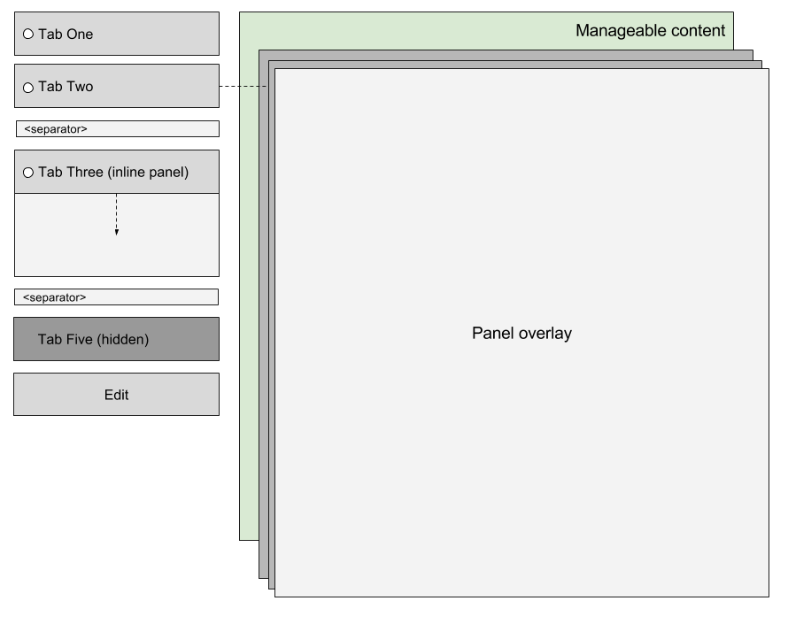
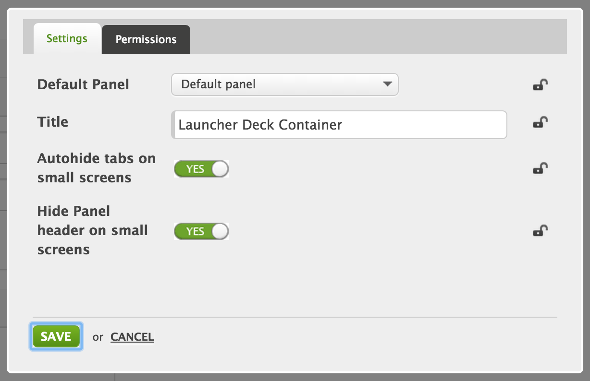
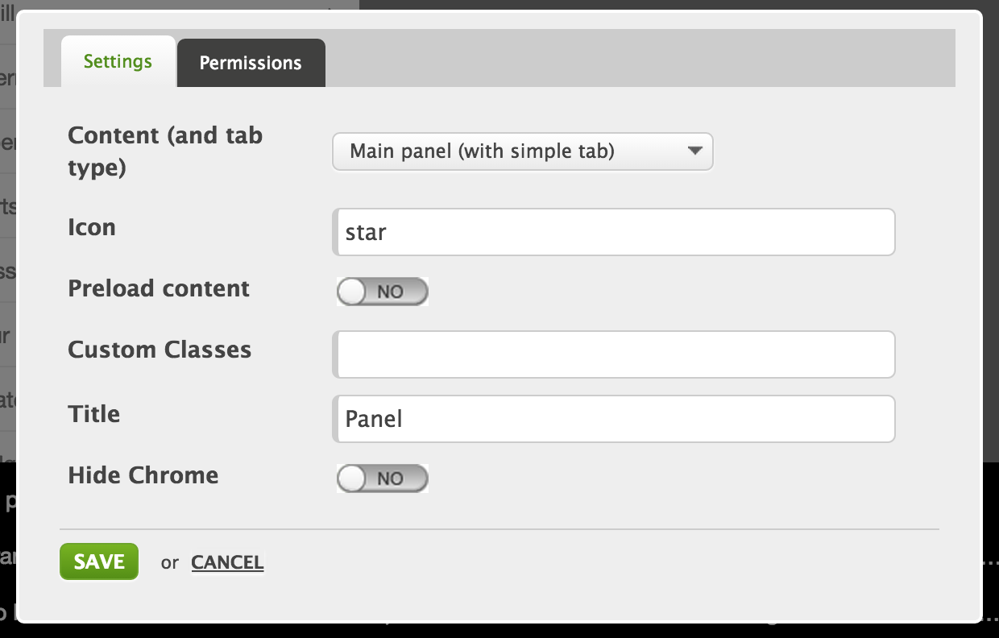

# LauncherDeckContainer
The launcher provides a navigation pattern within a web application, both for desktop and web. It is based on the 'Deck container', and enhances it by allowing for widgets to run both in the 'panels' and inside the 'tabs'.

## Information
|  name |  version |  bundle |
|--|:--:|--:|
|  container-launcher |  1.2.1 |  Universal |

## Dependencies

- container-deck ^1.1.0
- template-launcher ^1.1.0

## Product Description
Launcher container is a wrapper container for Panel containers. Based on panel preferences they could be rendered in different columns. There are two columns: Sidebar with list of tabs and "inline" panels and Main column.

## Functional Overview
Google closure (SOY) template (launcher-deck-container-web.soy) for rendering multiple panels.

Launcher Containter extends Deck Container and behave as a tab container with special styling considerations and advanced UX.

Managers and Masterpage Designers will be able to create and configure panels.

## Screenshots

## Features

- RTL support
- Touch support
- Responsive
- Lazy loading
- Accessibility
- i18n

## Preferences
### Launcher Container Preferences

#### Default panel
What panel to load by default (when no panel is requested via the URL).

#### Autohide tabs on small screens
To maximize the screen use, the tab strip can be hidden from the view. The Navbar-Advanced has a function to show the tab strip.

#### Hide Panel header on small screens
Since the Navbar-Advanced can already show the title of a panel, it can be hidden here.

#### Fix Default Panel
Makes the default panel to not be hidden when changing to another panel in the tabs. It will be shown in the background.

### Customizing Container Preferences
By changing those preferences it is possible to customize look and behavior of Launcher container

|  Preference name |  Type |  Default value |
|--|--|--|
|  `behaviors` |  string |  lp.retail.RetailBehaviors |
|  `autohideTabs` |  boolean |  true |
|  `autohideHeader` |  boolean |  true |
|  `fixDefaultPanel` |  boolean |  true |

### Panel Preferences

#### Content
Panel could be rendered on the Side panel or in the Main panel:

- 'Side panel (with expanded tab)'
- 'Side panel (with collapsed tab)'
- 'Side panel (tab without chrome)'
- 'Main panel (with simple tab)'
- 'Main panel (with hidden tab)'
- '2nd Level Parent (expanded)'
- '2nd Level Parent (collapsed)'

#### Icon
Value `star` will be rendered as: `<i class="lp-icon lp-icon-star"></i>`

On Panel creation value set to "star", but if value set to the empty sting it will be resolved as "lp-icon-blank" which has no icon assigned.

#### Custom Classes
Gives ability to add custom class names to the tab.

#### Preload Content
If enabled content of the panel will be rendered by the server. If property disabled this will activate "Lazy loading" for the panel. Child elements of a panel will be loaded on panel activation.

#### Hide Chrome
If enabled pane will not have wrapping chrome with "X" button. By default all panes has chrome except "Default panel".

## Behaviors
### gadgets.pubsub
|  Event |  Type |  Arguments |  Description |
|--|--|--|--|
|  `launchpad-retail.toggleLauncherMenu` |  subscribe + publish |  Boolean |  Used for toggling sidebar on the small screen |
|  `launchpad-retail.closeActivePanel` |  subscribe |   |   |
|  `launchpad-retail.offsetTopCorrection` |  subscribe |   |   |
|  `launchpad.add-notification` |  subscribe |   |   |
|  `launchpad-retail.toggleSlideElement` |  subscribe |  {selector: String, state: Boolean, duration: Number} |  Used for Slide-toggle animation |
|  `launchpad-retail.activeContextChanged` |  publish |  Panel Title |

### portaclient events
To notify child elements about the panel state change (show/hide) launcher container will trigger a portalclient event on every child inside the panel.
Widget can listen to those events and react accordingly

- `lp-launcher-panel-close`
- `lp-launcher-panel-open`

Example:
    `oWidget.addEventListener('lp-launcher-panel-open', callback);`

### DOM event bindings

- **swipe** (document.body) - toggling sidebar
- **keydown** (document) - listen to Escape key to close active panel

### Launchpad behaviors
Launcher container uses lp.retail.RetailBehaviors, which adds additional functionality to this container. It allows activate panels on key events and pubsub events from outside of the container.

## Read more

- [Deconstructing Behaviors](https://my.backbase.com/resources/how-to-guides/deconstructing-behaviors)

